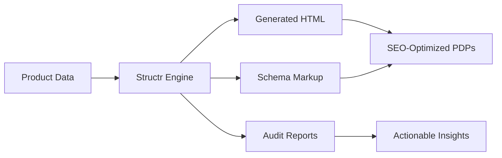
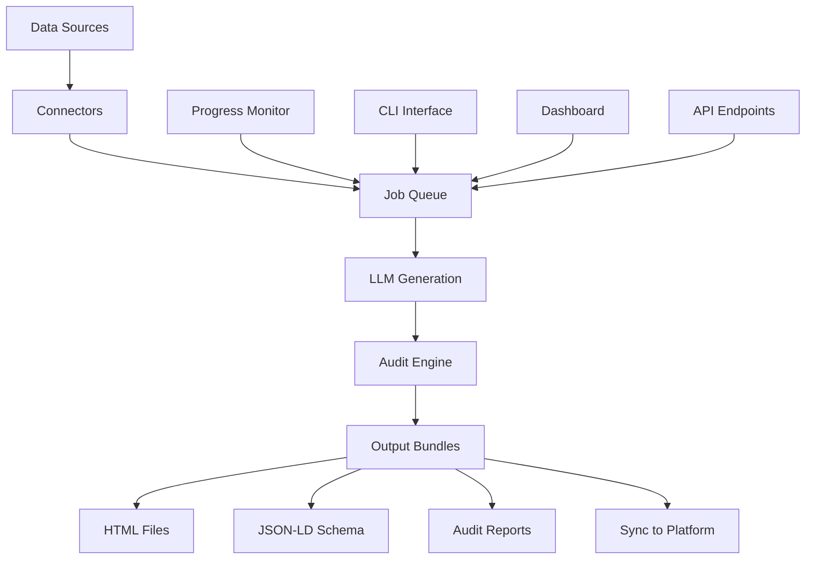

# Structr - Local-First PDP Optimization Engine

!!! abstract "What is Structr?"
    Structr is a lightweight, local-first product data engine for generating, auditing, and syncing SEO-critical content across eCommerce Product Detail Pages (PDPs). It prioritizes structure over fluff—enabling repeatable optimization at scale, without API bloat or platform lock-in.

## 🎯 Why Structr?

### The Problem

E-commerce teams face constant challenges with PDP optimization:

- **Silent Decay**: Product content quality degrades over time without visibility
- **Scale Issues**: Manual optimization doesn't scale to thousands of products  
- **Vendor Lock-in**: Cloud-only solutions create dependency and cost concerns
- **Structure Gaps**: Platforms focus on prose, not SEO-critical metadata and schema

### The Solution

Structr delivers a **structure-first approach** to PDP optimization:

## 🚀 Key Features

### 🖥️ Local-First Architecture
- **Offline Operation**: Uses Ollama + local LLMs for zero cloud dependency
- **Privacy**: All data processing happens on your infrastructure
- **Cost Control**: No API usage fees or token limits
- **Resilience**: Works without internet connectivity

### 🔁 CLI-First Workflow
- **Automation**: Built for CI/CD integration and batch processing
- **Testing**: Easy validation and A/B testing of PDP content
- **Scripting**: Integrate with existing e-commerce workflows
- **Debugging**: Full visibility into generation and audit processes

### 🧱 Structure Over Fluff
- **Metadata Focus**: Optimizes title tags, meta descriptions, and Open Graph
- **Schema Generation**: Automatic JSON-LD Product schema compliance
- **Field Validation**: Ensures all required SEO elements are present
- **Quality Scoring**: Quantitative assessment of PDP completeness

### 🔧 Platform Agnostic
- **CMS Integration**: Works with any e-commerce platform or CMS
- **API Connectors**: Seamless integration with Shopify, BigCommerce, custom APIs
- **Export Flexibility**: Multiple output formats (HTML, JSON, CSV)
- **Sync Capabilities**: Bi-directional sync with popular platforms

## 🆚 Structr vs. Traditional Tools

### Structr vs. EKOM

| Feature | **Structr** | EKOM |
|---------|-------------|------|
| **Architecture** | 🖥️ Local-first, offline-capable | ☁️ Cloud-only |
| **Cost Model** | 💰 Zero API costs, local processing | 💸 Per-request API pricing |
| **Data Privacy** | 🔒 Fully private, on-premise | 📡 Data sent to cloud |
| **Speed** | ⚡ Instant local processing | 🐌 Network-dependent |
| **Customization** | 🔧 Full control, open architecture | 🔐 Limited customization |
| **Integration** | 🔌 CLI, API, Dashboard | 🌐 Web-only interface |
| **Audit Visibility** | 📊 Detailed scoring and logs | 📈 Basic reporting |

### Structr vs. Manual PDP Management

| Aspect | **Manual Process** | **Structr** |
|--------|-------------------|-------------|
| **Scale** | 👥 Limited by human bandwidth | 🤖 Processes 1000s of products |
| **Consistency** | 📝 Varies by writer | 🎯 Standardized, repeatable |
| **SEO Compliance** | ❓ Hit-or-miss | ✅ Guaranteed schema compliance |
| **Quality Control** | 👀 Manual review required | 📊 Automated scoring and flagging |
| **Time to Deploy** | 📅 Days/weeks for large catalogs | ⏱️ Minutes for batch processing |

## 🏗️ Architecture Overview

### Core Components

=== "🔗 Connectors"
    Intelligent data import from multiple sources:
    
    - **Shopify CSV**: Automatic field mapping with 95%+ accuracy
    - **Generic CSV**: AI-powered field detection for any format
    - **REST APIs**: Real-time sync with any JSON API
    - **Webhooks**: Live updates when products change

=== "⚡ Batch Engine"
    Scalable processing infrastructure:
    
    - **Job Queue**: Thread-safe, persistent task management
    - **Parallel Processing**: Configurable worker pools (1-10 workers)
    - **Progress Monitoring**: Real-time updates and ETA calculations
    - **Error Recovery**: Isolated failures, automatic retry logic

=== "🤖 LLM Generation"
    Local language models for content creation:
    
    - **Ollama Integration**: Mistral, Llama2, CodeLlama support
    - **Template System**: Customizable output formats
    - **Context Aware**: Product-specific optimization
    - **Quality Control**: Built-in validation and scoring

=== "📊 Audit System"
    Comprehensive quality assessment:
    
    - **SEO Analysis**: Title, meta, schema validation
    - **Content Scoring**: Quantitative quality metrics
    - **Issue Detection**: Missing fields, formatting problems
    - **Historical Tracking**: Performance over time

## 🎯 Use Cases

### E-commerce Teams
- **Catalog Migration**: Bulk optimization during platform migrations
- **SEO Audits**: Regular assessment of PDP quality across entire catalog
- **A/B Testing**: Generate variations for performance testing
- **Compliance**: Ensure all products meet SEO and accessibility standards

### Agencies & Consultants
- **Client Onboarding**: Rapid assessment and optimization of existing catalogs
- **Reporting**: Detailed analytics for optimization recommendations
- **White-label**: Deploy as part of broader e-commerce solutions
- **Multi-client**: Manage optimization across multiple client accounts

### Developers & DevOps
- **CI/CD Integration**: Automated PDP validation in deployment pipelines
- **API-first**: Headless integration with existing e-commerce stacks
- **Monitoring**: Continuous quality monitoring and alerting
- **Customization**: Extend with custom connectors and processors

## 🚀 Getting Started

Ready to optimize your product pages? Choose your path:

-   :material-clock-fast:{ .lg .middle } **5-Minute Quickstart**

    ---

    Get Structr running with sample data in under 5 minutes

    [:octicons-arrow-right-24: Quickstart Guide](quickstart.md)

-   :material-console:{ .lg .middle } **CLI Commands**

    ---

    Learn the command-line interface for batch operations

    [:octicons-arrow-right-24: CLI Reference](cli-commands.md)

-   :material-view-dashboard:{ .lg .middle } **Dashboard Usage**

    ---

    Explore the visual interface for managing PDPs

    [:octicons-arrow-right-24: Dashboard Guide](dashboard-usage.md)

-   :material-api:{ .lg .middle } **API Integration**

    ---

    Integrate Structr with your existing systems

    [:octicons-arrow-right-24: API Reference](api-reference.md)

## 🏆 Success Stories

!!! success "Performance Improvements"
    
    === "Processing Speed"
        - **400% faster** batch processing vs. manual workflows
        - **95%+ accuracy** in automated field mapping
        - **Sub-second** local generation without API delays
    
    === "Quality Metrics"
        - **100% schema compliance** for Google Rich Results
        - **90%+ audit scores** across optimized catalogs
        - **Zero missing metadata** after optimization
    
    === "Operational Benefits"
        - **Zero cloud costs** for content generation
        - **Complete data privacy** with local processing
        - **24/7 availability** without internet dependency

---

**Next Steps**: Start with our [Quickstart Guide](quickstart.md) to get Structr running in minutes, or dive into the [CLI Commands](cli-commands.md) for advanced usage.